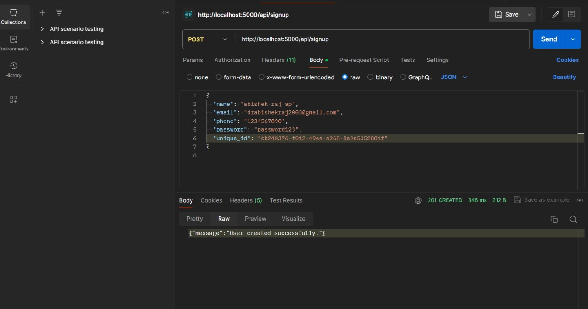
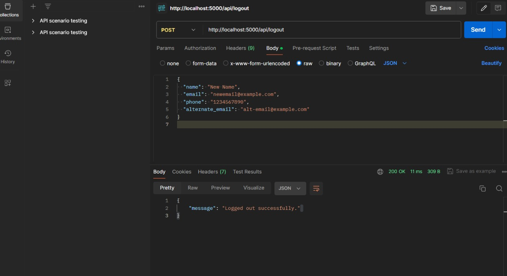

# Flask User Management API

This Flask User Management API provides a simple yet robust backend solution for managing users, including features like user registration with invitations, login with JWT authentication, and user profile editing with profile picture management. It's designed to be easily integrated into any front-end application requiring user management functionality.

## Features

- **User Invitation**: Generate unique invitation IDs to control user registration.
- **User Registration**: Sign up users with a unique invitation ID.
- **Authentication**: Secure user login with JWT-based authentication.
- **Profile Editing**: Allow users to update their profile information and manage their profile picture.
- **Database Integration**: Utilize SQLAlchemy for ORM and Flask-Migrate for database migrations.




## Getting Started

### Prerequisites

Ensure you have the following installed:
- Python 3.6+
- Flask
- Flask-SQLAlchemy
- Flask-Migrate
- Flask-JWT-Extended

### Installation

1. Clone the repository:

```bash
git clone https://github.com/ABISHEKBALANCE/User-Management-API.git
cd User-Management-API
```

2. Create a virtual environment and activate it:

```bash
python -m venv venv
source venv/bin/activate  # On Windows use `venv\Scripts\activate`
```

3. Install the required packages:

```bash
pip install Flask Flask-SQLAlchemy Flask-Migrate Flask-JWT-Extended
```

4. Initialize the database:

```bash
flask db init
flask db migrate -m "Initial migration."
flask db upgrade
```

### Configuration

Configure the application by setting the necessary environment variables. For development purposes, you can set them directly in your activate script or use a `.env` file with `python-dotenv`.

```plaintext
export FLASK_APP=run.py
export FLASK_ENV=development
export SECRET_KEY='your-secret-key'
export JWT_SECRET_KEY='your-jwt-secret-key'
```

### Running the Application

Start the Flask application by running:

```bash
flask run
```

The API will be available at `http://localhost:5000/`.

## API Endpoints

- POST `/api/invite` - Generate a unique invitation ID.
- POST `/api/signup` - Register a new user with the invitation ID.
- POST `/api/login` - Login and receive a JWT for authentication.
- POST `/api/edit_user` - Update user profile details.

## Testing

Test the API endpoints using Postman or any other API testing tool by sending the required payload to the respective endpoints.

## Contributing

Contributions are welcome! Please open an issue or submit a pull request with any improvements, bug fixes, or feature additions.

## License

This project is licensed under the MIT License - see the [LICENSE](LICENSE) file for details.
